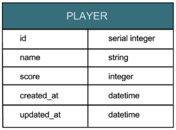
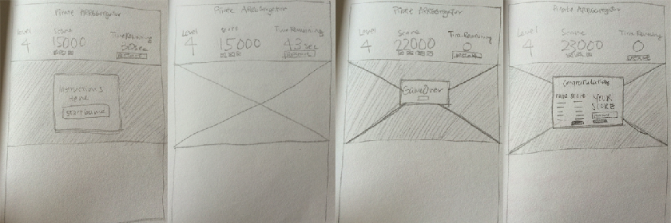

# Pirate ARRGGregator
### The Pirate Arrggregator is a game involving dynamically generated images. The objective is to find all the pirates hidden amongst other images within the given svg gameboard.

##### [pirate-arrggregator.herokuapp.com](http://www.pirate-arrggregator.herokuapp.com)

----

#### Reminiscent of arcade games, players can only save their name and scores if their score is higher than one on the current leaderboard.

---

### Resources

##### Javascript Libraries 
	 jQuery
	 Raphael.js
	 Underscore.js

##### Ruby Gems
	 sinatra
	 pg
	 activerecord
	 sinatra-activerecord

##### Images
[morguefile.com](http://www.morguefile.com/)
Used the following images as assets:
 red_pir.png by <a xmlns:cc="http://creativecommons.org/ns#" href="https://github.com/janeplural/pirate_arrggregator" property="cc:attributionName" rel="cc:attributionURL">JS</a> is licensed under a <a rel="license" href="http://creativecommons.org/licenses/by-sa/4.0/">Creative Commons Attribution-ShareAlike 4.0 International License</a>. Based on a work at <a xmlns:dct="http://purl.org/dc/terms/" href="http://commons.wikimedia.org/wiki/File:Louisiana_Renaissance_Festival_Pirate.jpg" rel="dct:source">http://commons.wikimedia.org/wiki/File:Louisiana_Renaissance_Festival_Pirate.jpg</a>.

 red_pirate_icon.png by <a xmlns:cc="http://creativecommons.org/ns#" href="https://github.com/janeplural/pirate_arrggregator" property="cc:attributionName" rel="cc:attributionURL">JS</a> is licensed under a <a rel="license" href="http://creativecommons.org/licenses/by-sa/4.0/">Creative Commons Attribution-ShareAlike 4.0 International License</a>. Based on a work at <a xmlns:dct="http://purl.org/dc/terms/" href="http://commons.wikimedia.org/wiki/File:Louisiana_Renaissance_Festival_Pirate.jpg" rel="dct:source">http://commons.wikimedia.org/wiki/File:Louisiana_Renaissance_Festival_Pirate.jpg</a>.

##### Colors
* [Charity - Adobe Kuler](https://kuler.adobe.com/Charity-color-theme-4196789/edit/?copy=true&base=2&rule=Custom&selected=2&name=Copy%20of%20Charity&mode=cmyk&rgbvalues=0.8509803921568627,0.30196078431372547,0.33725490196078434,0.3764705882352941,0.7294117647058823,0.611764705882353,0.6313725490196078,0.8392156862745098,0.7098039215686275,0.9372549019607843,0.9725490196078431,0.8588235294117647,1,1,1&swatchOrder=0,1,2,3,4)  
* [Prestige Practice Version 1 - Adobe Kuler](https://kuler.adobe.com/Prestige-Practice-Version-1-color-theme-4191431/edit/?copy=true&base=2&rule=Custom&selected=4&name=Copy%20of%20Prestige%20Practice%20Version%201&mode=rgb&rgbvalues=0.6313725490196078,0.7686274509803922,0.25098039215686274,0.9176470588235294,0.6,0.17254901960784313,0.25098039215686274,0.7450980392156863,0.6784313725490196,0.8941176470588236,0.788235294117647,0.23921568627450981,0.1411764705882353,0.18823529411764706,0.2&swatchOrder=0,1,2,3,4)
	
---

### Wireframe Sketches

